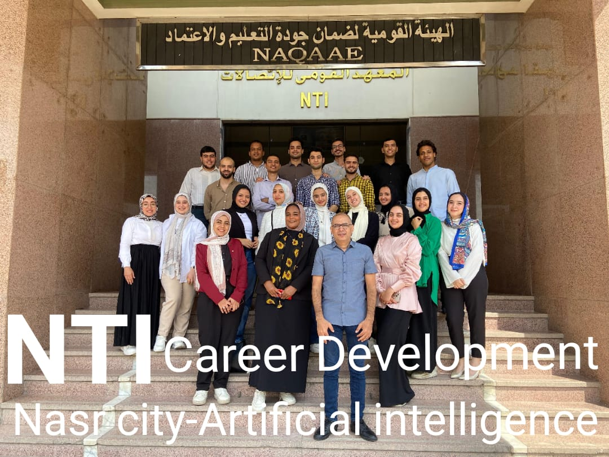

# Career Development (56 hours)

This course is designed to enhance essential skills required for career success in various professional environments. It focuses on soft skills, project management, and strategies for personal and team development. Below is a summary of the course content and related materials.

## Course Outline

### Soft Skills (42 hours)

1. **Communication Skills**
   - Enhancing verbal and non-verbal communication techniques.
2. **Leadership Skills and Problem Solving**
   - Leading teams and addressing complex problems with innovative solutions.
3. **Team Building**
   - Creating cohesive and effective teams in diverse work environments.
4. **Time Management**
   - Prioritizing tasks and managing time efficiently for better productivity.
5. **Interviewing**
   - Preparing for and excelling in job interviews.
6. **Presentation Skills**
   - Delivering impactful and professional presentations.
7. **Mentorship and Coaching**
   - Guiding and developing others to advance in their careers.
8. **Emotional Intelligence**
   - Understanding and managing emotions to improve interpersonal interactions.
9. **Stress Management**
   - Techniques for handling and reducing stress in the workplace.
10. **Workplace Legal Considerations**
    - Navigating legal aspects of workplace interactions and regulations.
11. **Managing Upwards**
    - Effectively managing relationships with superiors.
12. **Fit for Work**
    - Ensuring physical and mental well-being for optimal performance.
13. **Motivation**
    - Strategies for self-motivation and motivating others.
14. **Workplace Ethics**
    - Upholding ethical standards and practices in the workplace.
15. **Change Management**
    - Adapting to and managing organizational change effectively.
16. **Corporate Social Responsibility**
    - Understanding and implementing CSR practices in business.
17. **Work-Life Balance**
    - Balancing professional responsibilities with personal life for overall well-being.

### Project Management (14 hours)

1. **Project Management Framework**
   - Understanding the basics of managing projects efficiently.
2. **Project Scope Management**
   - Defining and controlling project scope to meet objectives.
3. **Project Schedule Management**
   - Planning and managing project timelines effectively.
4. **Project Cost Management**
   - Budgeting and applying cost control techniques.
5. **Project Risk Management**
   - Identifying and mitigating project risks.
6. **Project Monitoring and Controlling**
   - Ensuring projects stay on track through proper monitoring.
7. **Advanced Tools**
   - Utilizing project management software and methodologies for success.

## Attached Files

**Final Project**  
[Download Final Project (PPTX)](material/The%20Project%20Plan.pptx)

**Photo with Our Instructor**  

