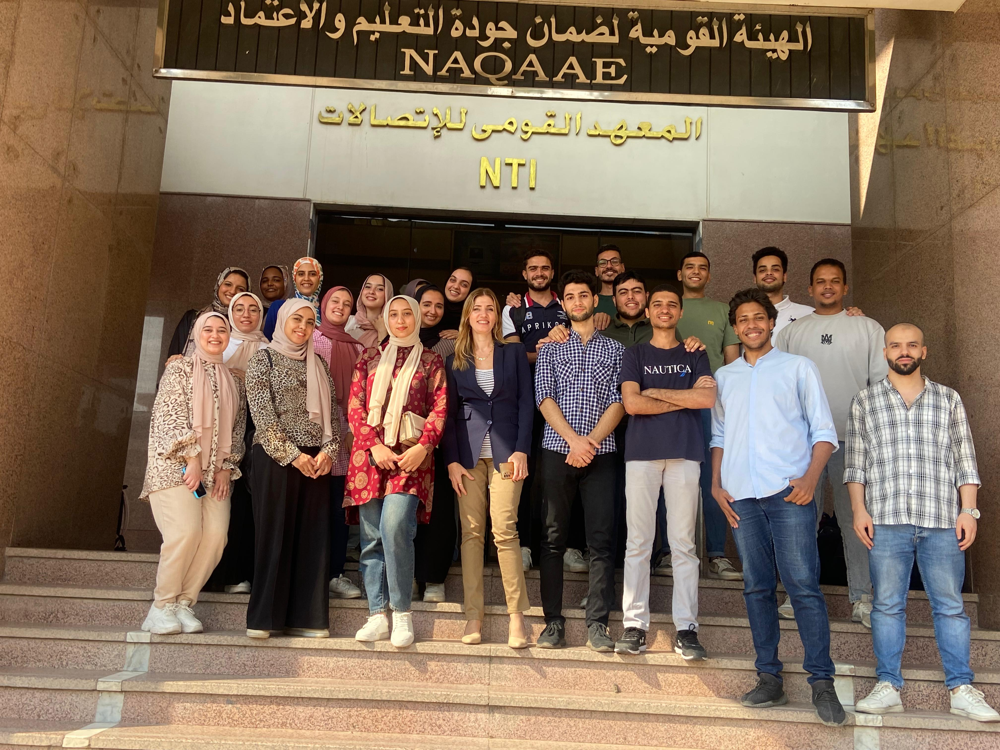

# Essential Workplace Skills (35 hours)

This course focuses on building the core skills necessary to excel in any professional environment. It covers teamwork, conflict resolution, ethics, adaptability, critical thinking, and workplace etiquette, among other important skills. Below is a summary of the course content and related materials.

## Course Outline

### Teamwork and Collaboration

1. **Building Effective Teams**
   - Techniques for fostering collaboration and synergy among team members.
2. **Role Clarity and Accountability**
   - Understanding individual roles and responsibilities within a team.
3. **Leveraging Diverse Skills**
   - Utilizing the diverse skills and perspectives of team members for better outcomes.

### Conflict Resolution

1. **Identifying and Addressing Conflicts**
   - Techniques for recognizing potential conflicts early and addressing them constructively.
2. **Mediation Skills**
   - Strategies for mediating disputes and facilitating positive resolutions.
3. **Negotiation Techniques**
   - Skills for negotiating win-win solutions and managing disagreements professionally.

### Professional Ethics

1. **Ethical Decision-Making**
   - Frameworks for making ethical decisions in various workplace scenarios.
2. **Integrity and Accountability**
   - Understanding the importance of honesty and taking responsibility for one’s actions.
3. **Navigating Ethical Dilemmas**
   - Strategies for handling ethical dilemmas and maintaining professional standards.

### Adaptability and Flexibility

1. **Embracing Change**
   - Techniques for adapting to organizational changes and new work environments.
2. **Resilience Building**
   - Developing resilience to handle setbacks and challenges effectively.
3. **Creative Problem Solving**
   - Using creative approaches to overcome obstacles and adapt to shifting priorities.

### Critical Thinking and Decision Making

1. **Analytical Skills**
   - Techniques for analyzing data and information to make informed decisions.
2. **Problem-Solving Strategies**
   - Structured approaches to identifying problems and developing effective solutions.
3. **Decision-Making Models**
   - Applying various decision-making models to enhance decision quality and effectiveness.

### Workplace Etiquette

1. **Professional Communication**
   - Best practices for clear, respectful, and effective communication in the workplace.
2. **Interpersonal Skills**
   - Enhancing interactions with colleagues, clients, and stakeholders through polite and professional behavior.
3. **Dress Code and Personal Presentation**
   - Understanding and adhering to appropriate dress codes and personal presentation standards.

### Additional Skills for a Competitive Edge

1. **Networking Skills**
   - Building and maintaining professional relationships to advance career opportunities.
2. **Time Management**
   - Advanced techniques for optimizing productivity and balancing multiple priorities.
3. **Customer Service Excellence**
   - Providing exceptional service to internal and external clients to enhance business relationships.
4. **Innovation and Creativity**
   - Encouraging innovative thinking and creative approaches to problem-solving and project development.

## Attached Files

